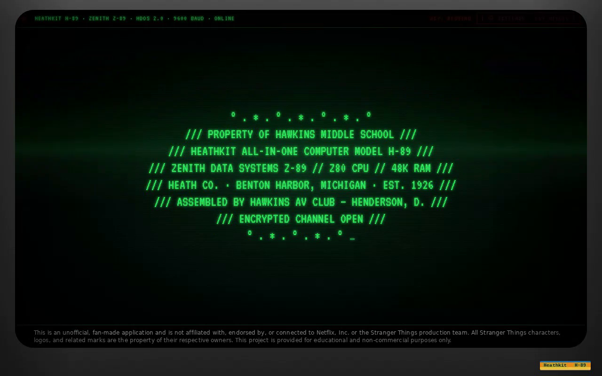

# Fan-Made Stranger Things AI App

A fan-made *Stranger Things* AI app, styled as a retro **Heathkit H-89**
green-phosphor terminal, that lets kids and adults explore the show's
lore safely and at the right depth — powered by Google Gemini 2.5 Flash.
Styled after a real 1980s Heathkit H-89 all-in-one computer: charcoal
plastic chassis, recessed CRT bezel, scanlines, slow vertical-hold roll,
blinking cursor, and a branded orange/blue Heathkit badge.

Live: <https://fanstrangerthings.app>

---

## Table of contents

- [Why this exists](#why-this-exists)
- [Summary](#summary)
- [Screenshots](#screenshots)
- [Capabilities](#capabilities)
- [How to use the app](#how-to-use-the-app)
- [Example prompts](#example-prompts)
- [Bring Your Own Key (BYOK) — session-only security model](#bring-your-own-key-byok--session-only-security-model)
- [Keep your info safe — user checklist](#keep-your-info-safe--user-checklist)
- [Cost — what to expect](#cost--what-to-expect)
- [Safety, supervision, and trademarks](#safety-supervision-and-trademarks)
- [IP / Legal Footer](#ip--legal-footer)
- [Tech stack](#tech-stack)
- [Architecture / How it works](#architecture--how-it-works)
- [Run locally](#run-locally)
- [Build](#build)
- [Project layout](#project-layout)
- [Known limitations](#known-limitations)
- [Accessibility](#accessibility)
- [License](#license)

---

## Why this exists

My nephew Noah is a young kid who desperately wanted to watch Netflix's
*Stranger Things*. My sister (Noah's mom) started Season 1 with him to
gauge what he could handle, and they hit a wall: Noah kept pausing the
show to ask questions, and she was often at a loss for the right words.

Noah is too little for the unpredictable nature of open-ended AI — he
needs a tool where he (or his mom) can get age-appropriate answers.
Meanwhile his mom wanted her *own* device to explore deep lore and the
origin story without risking spoilers for either of them.

So I opened Google's Vertex AI and built this — a fan-made application
on Gemini 2.5 Flash, dressed up like an 80s Heathkit H-89 terminal to
drop them straight into the world of the show.

## Summary

The app boots like a period-correct terminal
(`HEATHKIT H-89 · HDOS 2.0 · 9600 BAUD · ONLINE`), asks you to pick a
companion (Eleven for kids, Dustin for adults), confirms your spoiler
clearance by season (1–5 or *The First Shadow*), then streams
in-character lore answers character-by-character like an old CRT. The
whole experience runs client-side: there is no backend, no database, and
no analytics. You bring your own Google Gemini API key and it stays in
your browser tab.

## Screenshots

> Drop PNGs into `screenshots/` with the filenames below and they'll
> render here automatically.

| Step | Image |
| --- | --- |
| 1. Boot screen & mode select | `screenshots/01-boot.png` |
| 2. Eleven (Child Mode) — season select | `screenshots/02-eleven-season.png` |
| 3. Eleven answering a kid-safe question | `screenshots/03-eleven-chat.png` |
| 4. Dustin (Adult Mode) — season select | `screenshots/04-dustin-season.png` |
| 5. Dustin answering a deep-lore question | `screenshots/05-dustin-chat.png` |
| 6. SETTINGS modal (BYOK + cost note) | `screenshots/06-settings.png` |

Embed inline once added, for example:

```md

```

## Capabilities

### 🧇 Child Mode — persona inspired by Eleven (for Noah)

A strict safety layer overrides standard model behavior:

- **Reality Check Protocol** — hard-coded logic that clarifies monsters
  are "real in the show" but explicitly cannot enter his house.
- **Safety Filter** — zero-tolerance for disturbing descriptions. Scary
  requests are redirected and graphic imagery is replaced with safe,
  elementary observations.
- **Heroism Framing** — pivots scary answers to focus on how the friends
  protect each other rather than on the danger itself.
- **Syntactic Alignment** — vocabulary is constrained to Eleven's
  simple, fragmented Season 1 speech patterns.
- **Total Topic Lock** — refuses real-world discussion (news, cast,
  creators) to keep 100% immersion in the story. (Adult Mode shares
  this lock.)

### 🧢 Adult Mode — persona inspired by Dustin (for Noah's mom)

Built for logic and depth:

- **Spoiler Firewall** — a dynamic "Season State" check verifies the
  user's watch progress before every session and blocks future plot
  leaks. (Child Mode shares this strict firewall.)
- **History Recall** — selecting Season 5 unlocks the complete archive
  of every previous season, so an adult mid-Volume 1 can ask "wait, who
  was that guy again?" and get instant Seasons 1–4 context without
  leaving the interface. (Eleven also has this encyclopedic memory.)
- **Deep Lore Integration** — discussion of the stage play *The First
  Shadow* is unlocked for theory-crafting toward the final season.
  (Child Mode can access this too, age-appropriately.)
- **Tonal Shift** — high-detail responses with scientific analogies and
  D&D metaphors tuned to an adult fan.

### 🔄 Mode switching

A **RESET** protocol allows seamless hand-offs between Noah (Child Mode)
and his mom (Adult Mode) on the same device. Type `reset` in the input
at any time to return to the boot screen.

### 🔦 80s terminal experience

- Authentic **Heathkit H-89** charcoal-plastic chassis with realistic
  shading, recessed CRT bezel, and a period-correct orange/blue Heathkit
  H-89 brand badge.
- **CRT scanline overlay**, slow vertical-hold roll, subtle flicker, and
  green-phosphor glow.
- **Slim, era-appropriate blinking cursor**.
- **Character-by-character output rendering** so responses appear one
  character at a time like an old Heathkit terminal.
- **Clearer input placeholder text** for more intuitive onboarding.
- Persistent **IP / legal footer** on every screen.

## How to use the app

1. Open <https://fanstrangerthings.app> (or run locally — see
   [Run locally](#run-locally)).
2. Click **`[ ⚙ SETTINGS ]`** in the top-right of the status strip.
3. Paste your Google Gemini API key (get one free at
   [Google AI Studio](https://aistudio.google.com/app/apikey)) and
   **`[ SAVE ]`**. The key lives in this browser tab only.
4. On the boot screen, choose **`🧇 ELEVEN`** (kid-safe) or
   **`🧢 DUSTIN`** (full lore).
5. When the companion asks, type the highest season you've watched —
   `1`, `2`, `3`, `4`, `5`, or `first shadow`. This sets your spoiler
   firewall.
6. Ask any *Stranger Things* question. The terminal will type the answer
   one character at a time.
7. To switch users / personas, type **`reset`** to return to the boot
   screen.

## Example prompts

### 🧇 Eleven (Child Mode)

- *"Is the Demogorgon real?"*
- *"What is the Upside Down?"*
- *"How does Eleven keep her friends safe?"*
- *"What is a Demodog?"*
- *"Why does Eleven get nosebleeds?"*

### 🧢 Dustin (Adult Mode)

- *"What's the connection between Vecna and Henry Creel?"*
- *"Explain the Mind Flayer's hive-mind in D&D terms."*
- *"Wait, who was Bob again and what happened to him?"* (great
  History Recall test on Season 5 clearance)
- *"What does *The First Shadow* set up for Season 5?"*
- *"Recap the Russian plotline from Season 3."*

## Bring Your Own Key (BYOK) — session-only security model

This project never ships an API key and never proxies your traffic. You
supply your own Google Gemini key through the in-app **SETTINGS** modal
and it is used to call Google's API directly from your browser.

The key handling is deliberately strict and **isolated per visitor**:

- **Stored in `sessionStorage` only.** It lives in a single browser tab
  and is wiped the moment that tab is closed.
- **Never written to `localStorage`.** No "remember me", no long-lived
  persistence.
- **Never sent to any project-owned server or database.** There is no
  server component that sees the key — requests go browser → Google
  directly.
- **Never hardcoded in the source.** Search the repo; you will not find
  one.
- **Not shared across tabs, visitors, or devices.** Every person who
  opens the app gets their own empty session and must paste their own
  key. One visitor cannot see, reuse, or trigger billing on another
  visitor's key.
- **Not visible to other users of the app.** There is no shared state.
  Your key cannot be exfiltrated by someone else loading the site.

If no key is present, the terminal posts a non-blocking system notice
pointing you to the SETTINGS modal instead of failing silently.

## Keep your info safe — user checklist

This app is BYOK (bring your own key), so the security of your Google
Gemini key is mostly in your hands. Follow these rules and your key
stays yours.

**Before you paste your key**

1. **Confirm the URL.** Only paste your key on
   `https://fanstrangerthings.app` (or a localhost copy you built
   yourself). Check for the padlock and the exact domain — phishing
   clones are the #1 way BYOK keys get stolen.
2. **Use a dedicated key, not your "main" Google Cloud key.** In
   [Google AI Studio](https://aistudio.google.com/app/apikey), create a
   *new* API key just for this app. If it ever leaks, you can revoke
   that one key without touching anything else.
3. **Set a spending cap / quota in Google Cloud.** Even though the free
   tier covers casual use, go to your Google Cloud project for that key
   and set a daily quota or a billing alert. This caps the blast radius
   if a key ever escapes.
4. **Never paste your key into chat, screenshots, GitHub issues, or
   Discord.** If you share a screenshot of the SETTINGS modal, the key
   input is masked — keep it that way.

**While you're using the app**

5. **Don't use it on a shared or public computer** (library, hotel
   lobby, classroom) unless you plan to close the tab when you're done.
   The key lives in `sessionStorage`, which is wiped on tab close — but
   only if you actually close the tab.
6. **Use the RESET / clear-key button when you're finished** on any
   device that isn't exclusively yours. The SETTINGS modal has a
   "Clear key" action that wipes the key immediately.
7. **Keep your browser and extensions trustworthy.** A malicious
   browser extension with "read all site data" permission can read any
   key any web app stores — that is true of every BYOK tool on the
   internet, not just this one. Audit your extensions.
8. **Don't fork the repo and hardcode your key into the source.** The
   app is designed so the key is only ever entered at runtime in the
   browser. If you commit a key to a fork, GitHub's secret scanner (and
   bots) will find it within minutes.

**If you think your key leaked**

9. **Revoke it immediately** at
   <https://aistudio.google.com/app/apikey> — delete the key, then
   generate a new one. Revocation is instant.
10. **Check your Google Cloud billing** for unexpected usage on that
    key's project and file a billing dispute with Google if needed.
11. **Clear the app's storage** for `fanstrangerthings.app` in your
    browser's site settings, then paste the new key.

**What this app will never do**

- Ask you to email, DM, or paste your key anywhere outside the
  SETTINGS modal.
- Send your key to any server owned by this project — there is no
  such server.
- Store your key in `localStorage`, cookies, or any cross-tab
  location.
- Log, analyze, or transmit your prompts or Gemini's responses
  anywhere other than directly between your browser and Google.


## Cost — what to expect

This app does not bill you. Google bills you (or doesn't, if you stay in
the free tier) for the model calls your key makes.

- **Free tier (recommended for almost everyone).** Google AI Studio
  offers a free tier on `gemini-2.5-flash` with per-minute and per-day
  rate limits and no credit card required. Casual chatting — a few
  questions here and there — comfortably fits inside the free tier.
- **Paid tier (if you exceed the free limits).** At current Gemini 2.5
  Flash pricing, a typical chat turn (a short question + a few
  paragraphs of answer) costs a small fraction of a cent. A long
  evening of heavy back-and-forth is usually well under $1. Pricing
  changes — always check Google's current rates at
  <https://ai.google.dev/pricing>.

The cost note is also surfaced inside the app's SETTINGS modal so
visitors see it before they paste a key.

## Safety, supervision, and trademarks

- **Adult supervision recommended.** Child Mode's safety rules are a
  best-effort prompt layer on a third-party LLM (Google Gemini). They
  are strong, but no LLM safety layer is perfect. An adult should sit
  with a young child the first few times they use it.
- **Fan project, not affiliated.** Not endorsed by or connected to
  Netflix, the Stranger Things production team, or Heathkit. All
  trademarks belong to their respective owners. See `LICENSE` and the
  in-app footer.

## IP / Legal Footer

Every screen of the app renders a persistent footer disclaiming any
affiliation with the rights holders. The exact text is:

> This is an unofficial, fan-made application and is not affiliated with,
> endorsed by, or connected to Netflix, Inc. or the Stranger Things
> production team. All Stranger Things characters, logos, and related
> marks are the property of their respective owners. This project is
> provided for educational and non-commercial purposes only.

The footer lives in `src/routes/index.tsx` inside the
`<footer className="crt-footer">` element and is styled by the
`.crt-footer` rule in `src/styles.css`. It must remain visible — do not
remove or hide it.

## Tech stack

- **Framework:** [TanStack Start](https://tanstack.com/start) v1 (full-stack React framework, file-based routing)
- **UI:** [React 19](https://react.dev) + [TypeScript](https://www.typescriptlang.org/)
- **Build tool:** [Vite 7](https://vitejs.dev)
- **Styling:** [Tailwind CSS v4](https://tailwindcss.com) with CSS-variable design tokens in `src/styles.css`
- **AI SDK:** [`@google/genai`](https://www.npmjs.com/package/@google/genai) calling Gemini directly from the browser
- **Model:** `gemini-2.5-flash`
- **UI primitives:** [shadcn/ui](https://ui.shadcn.com) on [Radix UI](https://www.radix-ui.com)
- **Routing:** [TanStack Router](https://tanstack.com/router) (file-based, type-safe)
- **Data:** [TanStack Query](https://tanstack.com/query) (configured; not heavily used — this app is largely stateless)
- **Validation:** [Zod](https://zod.dev)
- **Package manager:** [Bun](https://bun.sh) (npm/pnpm also work)
- **Font:** [VT323](https://fonts.google.com/specimen/VT323) for the CRT terminal look
- **Backend:** none — the app is fully client-side

## Architecture / How it works

```
┌─────────────────────────────────────────────┐
│  Visitor's browser tab                      │
│                                             │
│   sessionStorage  ← Gemini API key (only)   │
│        │                                    │
│        ▼                                    │
│   @google/genai SDK                         │
│        │                                    │
│        │  HTTPS                             │
└────────┼────────────────────────────────────┘
         ▼
   Google Gemini API  (gemini-2.5-flash)
```

- The static app is served from Lovable hosting (or your own host).
- There is no backend owned by this project. Nothing on a server sees
  the user's key, prompts, or responses.
- The system prompt (`src/constants.ts`) selects the Eleven or Dustin
  persona, injects the safety/spoiler rules, and pins the season
  clearance level.
- Responses stream back token-by-token; the UI renders them one
  character at a time for the CRT typewriter effect.
- Typing `reset` clears the in-memory chat handle and returns the user
  to the boot screen.

## Run locally

Requirements: [Bun](https://bun.sh) (or npm/pnpm) and Node-compatible
TypeScript tooling.

```bash
# 1. Clone the repo
git clone https://github.com/<your-account>/<repo-name>.git
cd <repo-name>

# 2. Install dependencies
bun install   # or: npm install / pnpm install

# 3. Start the dev server
bun run dev   # or: npm run dev / pnpm dev
```

The app starts on `http://localhost:8080`.

1. Open the URL in your browser.
2. Click **`[ ⚙ SETTINGS ]`** (top right).
3. Paste a Gemini key from
   <https://aistudio.google.com/app/apikey> and save.
4. Pick a mode and start asking questions.

## Build

```bash
bun run build       # production build
bun run preview     # serve the production build locally
bun run lint        # eslint
bun run format      # prettier
```

## Project layout

```
.
├── LICENSE                      Fan-project license + trademark disclaimer
├── README.md                    This file
├── package.json                 Dependencies, scripts
├── vite.config.ts               Vite + TanStack Start config
├── tsconfig.json                TypeScript config
├── src/
│   ├── routes/                  TanStack Start file-based routes
│   │   ├── __root.tsx           App shell + sitewide head metadata
│   │   └── index.tsx            Home route + boot/chat/footer layout
│   ├── components/
│   │   ├── BootSequence.tsx     Boot screen + mode select
│   │   ├── ChatInterface.tsx    Streaming chat UI w/ blinking cursor
│   │   ├── SettingsModal.tsx    BYOK key entry, cost note, safety note
│   │   ├── SpoilerCheck.tsx     Season clearance UI helpers
│   │   ├── icons.tsx
│   │   └── ui/                  shadcn/ui primitives
│   ├── hooks/
│   │   └── useGeminiChat.ts     Reads key from sessionStorage, builds
│   │                            the Eleven/Dustin chat session
│   ├── lib/
│   │   ├── apiKeyStorage.ts     Single source of truth for BYOK policy
│   │   ├── utils.ts
│   │   └── error-*.ts           Error reporting helpers
│   ├── constants.ts             Eleven/Dustin personas, safety layer,
│   │                            per-season spoiler firewall
│   ├── styles.css               H-89 chassis, CRT bezel, scanlines,
│   │                            blinking cursor, .crt-footer styling
│   └── types.ts                 Mode/Season/Message/AppState types
└── screenshots/                 (drop screenshots here — see Screenshots)
```

## Known limitations

- **Best-effort safety, not certified safety.** Child Mode's
  guardrails are prompt-based and depend on Gemini behaving as
  instructed. Adult supervision is recommended for young children.
- **No analytics / no telemetry.** Intentional — but it means there are
  no usage metrics out of the box.
- **No multi-user accounts.** Each browser tab is its own session.
  Conversation history is not persisted across tabs or reloads.
- **Motion-heavy CRT effects, with an opt-out.** Scanlines,
  vertical-hold roll, flicker, and the blinking REC dot can affect
  users with vestibular sensitivity. The app honors the OS-level
  `prefers-reduced-motion` setting and disables those animations
  automatically when it is enabled.
- **Heathkit H-89 aesthetic only.** Not a faithful emulator — no HDOS
  prompt, no keyboard remap, no serial protocol. The status strip
  (`HEATHKIT H-89 · HDOS 2.0 · 9600 BAUD · ONLINE`) is period-correct
  flavor, not an emulated environment.

## License

See [`LICENSE`](./LICENSE). Fan project for non-commercial, educational
use only. The in-app IP/legal footer must remain visible in any
deployment or derivative work.
